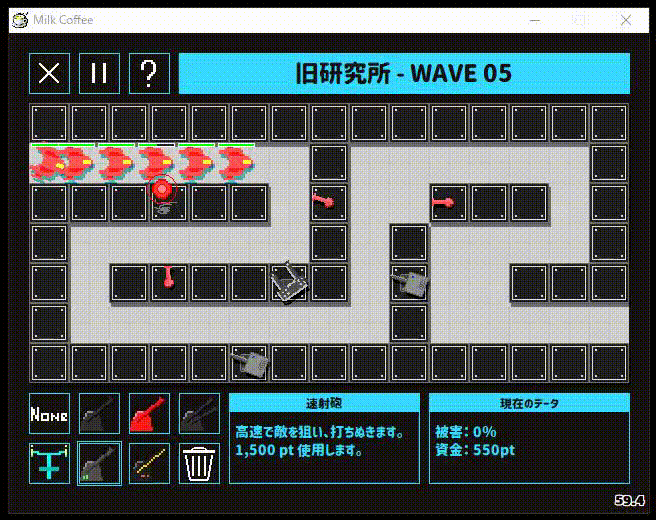
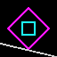
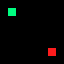

 
  
  
  <!--  -->
  

   
   
  

 

<!--  -->

#### gif animation

  
  
  
  
  
  
   
  
  <!--  -->
  
  

 

#### link
- [🍣 WebSite](https://tomsuzuki.github.io/)
- [💬 GitHub Gist](https://gist.github.com/TomSuzuki)
<!-- - [💙 Color Pallet](https://tomsuzuki.github.io/ColorPalette/) -->
<!-- - [📝 Today I Learned](https://tomsuzuki.github.io/til/) -->
