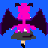

 
  
  

  
  
  

 

<!--  -->

#### game.gif

  
  
  
  <!--  -->
    
  
  
  
  

 

#### link
- [🍣 WebSite](https://tomsuzuki.github.io/portfolio/)
- [💬 GitHub Gist](https://gist.github.com/TomSuzuki)
- [💙 Color Pallet](https://tomsuzuki.github.io/ColorPalette/)
- [📝 Today I Learned](https://tomsuzuki.github.io/til/)
- [🎮 To Do List](https://github.com/TomSuzuki/human-life)
